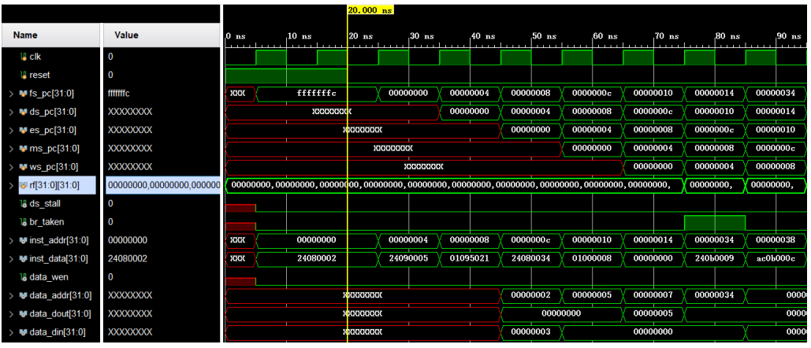

# pipeline
基于MIPS32的5级流水CPU的设计、实现与应用。

1. 利用前递技术（阻塞和前馈机制）处理5级流水线中的结构冲突和数据冲突（RAW、WAW、WAR）,最大限度地实现5级流水功能
2. 使用Verilog语言实现5级流水CPU
3. 使用MIPS32汇编实现带括号的四则运算计算器，并实现对表达式错误、溢出、除数为0等错误的检测功能
4. 根据EGO1开发板的管脚特性，完成SOC设计，实现相应的IO控制
5. 将MIPS32汇编代码转换为机器码并导入到存储器中，烧制EGO1开发板，验证计算器的功能

## 安装

使用Vivado 2019及以上版本打开项目，进行仿真可查看5级流水功能。

## 结果展示

